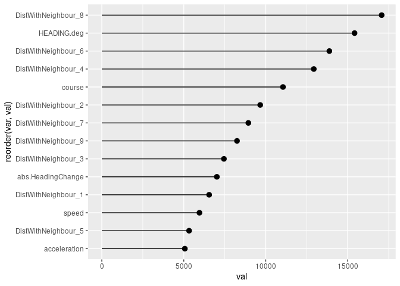

<!-- README.md is generated from README.Rmd. Please edit that file -->

# WKSSFGEO

<!-- badges: start -->
<!-- badges: end -->

The goal of WKSSFGEO is to provide a convenient wrapper of the data and
the function that were explored during WKSSFGEO 2021.

## Installation

You can install the development version of WKSSFGEO from
[GitHub](https://github.com/) with:

``` r
# install.packages("devtools")
devtools::install_github("ices-eg/WKSSFGEO", ref = "pkg")
```

## Example

This is a basic example which shows you how to solve a common problem:

``` r
library(WKSSFGEO)
ls(2)
#>  [1] "%>%"                              "add_harbours"                    
#>  [3] "CalcAcceleration"                 "CalcDist"                        
#>  [5] "CalcDistBetweenNearestNeighbours" "CalcHeading"                     
#>  [7] "CalcSpeed"                        "CalcStraigthness"                
#>  [9] "define_trips_pol"                 "dfTOsf"                          
#> [11] "harbours"                         "interpolate_ais"                 
#> [13] "track01"                          "tune_RF"
tracks <- 
  track01 %>% 
  data.table::setDT() %>% 
  unique(by = c("vessel_id", "time_stamp")) %>% 
  add_harbours(harbours) %>% 
  interpolate_ais() %>% 
  define_trips_pol(min_dur = 0.8, max_dur = 48, 
                   split_trips = T, preserve_all = F)
```

``` r
nnai <- apply( tracks[, c("speed", "course", "behaviour" )], 1, function(x) !anyNA(x))
trips <- unique(tracks$trip_id)
out2 <- tracks
tracks <- do.call( rbind, lapply( trips, function(tp) {
  
  out.trip <- out2[nnai, ] %>% as.data.frame
  out.trip <- out.trip[ out.trip$trip_id %in% tp, ]
  out.NewCovar <- CalcAcceleration(
    CalcDistBetweenNearestNeighbours(
      CalcStraigthness(
        CalcHeading( sf::st_as_sf( out.trip, 
                               coords = c("lon", "lat"), crs = 4326))
        ,   col.Dir = "course"),
      nnn = 9))
  return(out.NewCovar)
}))
dplyr::glimpse(tracks)
#> Rows: 329,778
#> Columns: 27
#> $ vessel_id           <chr> "EX_1", "EX_1", "EX_1", "EX_1", "EX_1", "EX_1", "E…
#> $ time_stamp          <dttm> 2018-10-06 06:39:46, 2018-10-06 06:39:56, 2018-10…
#> $ speed               <dbl> 5.062, 5.077, 5.349, 5.293, 5.423, 5.312, 5.315, 5…
#> $ course              <dbl> 94.42, 111.73, 115.78, 120.21, 122.77, 126.52, 124…
#> $ gear                <chr> NA, NA, NA, NA, NA, NA, NA, NA, NA, NA, NA, NA, NA…
#> $ behaviour           <chr> "Other", "Other", "Other", "Other", "Other", "Othe…
#> $ SI_HARB             <dbl> 0, 0, 0, 0, 0, 0, 0, 0, 0, 0, 0, 0, 0, 0, 0, 0, 0,…
#> $ source              <chr> "AIS", "AIS", "AIS", "AIS", "AIS", "AIS", "AIS", "…
#> $ INTV                <dbl> 0.1833333, 0.1666667, 0.1666667, 0.1666667, 0.1666…
#> $ id                  <int> 13, 14, 15, 16, 17, 18, 19, 20, 21, 22, 23, 24, 25…
#> $ year                <int> 2018, 2018, 2018, 2018, 2018, 2018, 2018, 2018, 20…
#> $ SI_HARB2            <dbl> 0, 0, 0, 0, 0, 0, 0, 0, 0, 0, 0, 0, 0, 0, 0, 0, 0,…
#> $ HARB_EVENT          <dbl> 1, 0, 0, 0, 0, 0, 0, 0, 0, 0, 0, 0, 0, 0, 0, 0, 0,…
#> $ trip_id             <chr> "EX_1_1", "EX_1_1", "EX_1_1", "EX_1_1", "EX_1_1", …
#> $ HEADING.deg         <dbl> 349.0652, 335.3786, 331.9851, 328.8318, 325.1821, …
#> $ abs.HeadingChange   <dbl> 1.00, 17.31, 4.05, 4.43, 2.56, 3.75, 2.28, 1.63, 0…
#> $ DistWithNeighbour_1 <dbl> 5.541480, 11.241968, 16.637005, 12.260861, 6.22751…
#> $ DistWithNeighbour_2 <dbl> 25.31709, 21.36669, 17.22131, 21.59121, 26.03763, …
#> $ DistWithNeighbour_3 <dbl> 26.52945, 26.52945, 26.77425, 27.22799, 27.28964, …
#> $ DistWithNeighbour_4 <dbl> 37.72670, 26.77425, 27.22799, 27.28964, 27.46623, …
#> $ DistWithNeighbour_5 <dbl> 52.92396, 43.61582, 47.99958, 43.71315, 38.82402, …
#> $ DistWithNeighbour_6 <dbl> 69.99816, 51.33866, 48.80504, 52.92005, 54.49699, …
#> $ DistWithNeighbour_7 <dbl> 79.86702, 53.97857, 52.92396, 53.97857, 54.84740, …
#> $ DistWithNeighbour_8 <dbl> 101.41756, 75.56695, 54.49699, 54.72810, 61.71097,…
#> $ DistWithNeighbour_9 <dbl> 106.85362, 81.20366, 76.87571, 75.08601, 71.00196,…
#> $ acceleration        <dbl> 0.0000000, 0.2611834, 0.2751763, 0.2722954, 0.2789…
#> $ geometry            <POINT [°]> POINT (12.53915 55.95447), POINT (12.53957 5…
```

``` r
nnn <- 9 # Number of nearest neighbours chosen
covar.names <- 
  c("speed", "course", "abs.HeadingChange", "HEADING.deg", "acceleration", 
    paste0( "DistWithNeighbour_", WKSSFGEO:::set_0nbr(1:nnn), 1:nnn))
form <- as.formula( paste( "behaviour", paste(covar.names, collapse = "+"), sep = "~"))
tracks$behaviour <-  factor(as.character(tracks$behaviour))
# Identify indexes without missing values (normally, none of them should contain missing values)
nnai <- apply( tracks[, c("behaviour", covar.names)], 1, function(x) !anyNA(x))
!nnai %>% any
#> [1] FALSE

# EINAR: the {tune_RF} finds the "optimimum" min.node.size and mtry to be passed
#        to {ranger} in the next step
optim.rf <- WKSSFGEO::tune_RF(formula = form, sf::st_set_geometry(tracks[nnai, ], NULL))
optim.rf # Automatically selected hyper-parameters
#> $min.node.size
#> [1] 2
#> 
#> $mtry
#> [1] 5
mod.rf <- ranger::ranger(form, 
                         sf::st_set_geometry(tracks[nnai, ], NULL),  
                         importance = "impurity", 
                         mtry =  optim.rf$mtry, 
                         min.node.size =  optim.rf$min.node.size, 
                         num.trees = 500,
                         write.forest = TRUE)
#> Growing trees.. Progress: 73%. Estimated remaining time: 11 seconds.
mod.rf # OOB prediction error 11.17%
#> Ranger result
#> 
#> Call:
#>  ranger::ranger(form, sf::st_set_geometry(tracks[nnai, ], NULL),      importance = "impurity", mtry = optim.rf$mtry, min.node.size = optim.rf$min.node.size,      num.trees = 500, write.forest = TRUE) 
#> 
#> Type:                             Classification 
#> Number of trees:                  500 
#> Sample size:                      329778 
#> Number of independent variables:  14 
#> Mtry:                             5 
#> Target node size:                 2 
#> Variable importance mode:         impurity 
#> Splitrule:                        gini 
#> OOB prediction error:             11.17 %
# Shows variable importance regarding how they contribute to the model
tibble::tibble(var = names(mod.rf$variable.importance),
               val = mod.rf$variable.importance) %>% 
  ggplot2::ggplot() +
  ggplot2::geom_pointrange(ggplot2::aes(reorder(var, val), val, ymin = 0, ymax = val)) +
  ggplot2::coord_flip()
```


